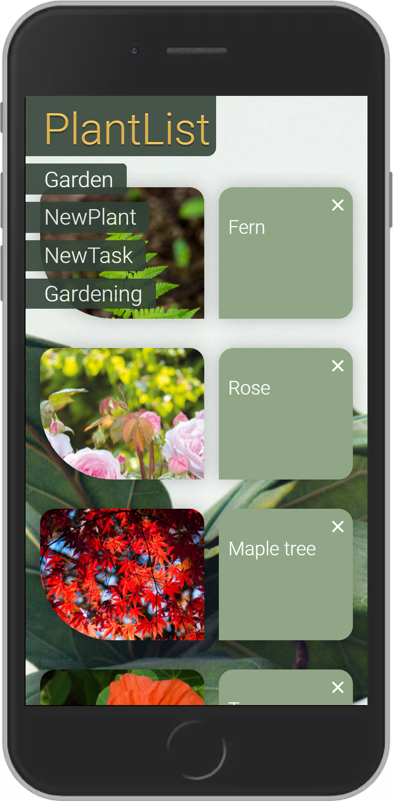
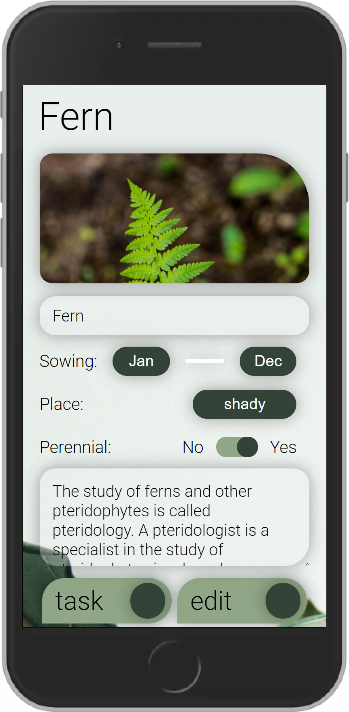

# 👩‍🌾👨‍🌾 Pocket Garden 🌱

<p>Pocket Garden is a web application for managing your garden. You can add new or already existing Plants from your real Garden in the little virtual helper. Then it's time to create tasks to remind yourself to give your garden what it needs!</p>

<br/>



</div>



<div align="center">
<a href="https://pocket-garden.herokuapp.com/">Try it out! *</a>
</div>

<br />

<p>* The deployment takes a little longer the first time it is loaded, because Heroku's servers fall asleep.</p>

## Setup

Install dependencies with:

```shell
npm install
```

This will install the dependencies required to run this project.

Build the app for production to the dist folder:

```shell
npm run build
```

It correctly bundles React in production mode and optimizes the build for the best performance.
The build is minified and the filenames include the hashes

Run the server in production mode and serve production bundle from npm run build:

```shell
npm start
```

Run the app in development mode:

```shell
npm run client:dev
```

Open http://localhost:3000 (default PORT) to view it in the browser.
The page will automatically reload if you make changes to the code. You will see the build errors and lint warnings in the console.

Run the server in development mode:

```shell
npm run server:dev
```

Run storybook:

```shell
npm run storybook
```

Create an `.env` file inside the main folder with the following environment variables:

```shell
PORT=
MONGODB_URL=
VITE_CLOUDINARY_PRESET_NAME=
VITE_CLOUDINARY_CLOUD_NAME=
```

You need a [Cloudinary](https://cloudinary.com/) account for image upload and a [MongoDB](https://www.mongodb.com/en-us) database.

## Developing

### Build With

[React](https://reactwithhooks.netlify.app/)

### Tech Stack

- [HTML5](https://developer.mozilla.org/en-US/docs/Glossary/HTML5)
- [CSS3](https://developer.mozilla.org/en-US/docs/Web/CSS)
- [JavaScript](https://developer.mozilla.org/en-US/docs/Web/JavaScript)
- [TypeScript](https://www.typescriptlang.org/)
- [React](https://reactwithhooks.netlify.app/)
- [React Hooks](https://reactwithhooks.netlify.app/docs/hooks-intro.html)
- [React Router](https://reactrouter.com/)
- [MongoDB](https://www.mongodb.com/)
- [Express.js](http://expressjs.com/)
- [Node.js](https://nodejs.org)
- [Storybook](https://storybook.js.org/)
- [Heroku](https://www.heroku.com)
- [Cloudinary](https://cloudinary.com/)
- [dotenv](https://github.com/motdotla/dotenv)
- [JEST](https://jestjs.io/)
- [Prettier](https://prettier.io/)
- [ESLint](https://eslint.org/)
- [Husky](https://github.com/typicode/husky)
- [Lint-Staged](https://github.com/okonet/lint-staged)
- [Adobe XD](https://www.adobe.com/products/xd.html)
